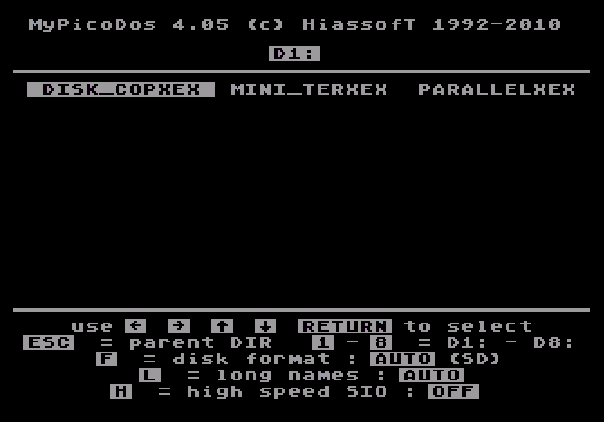
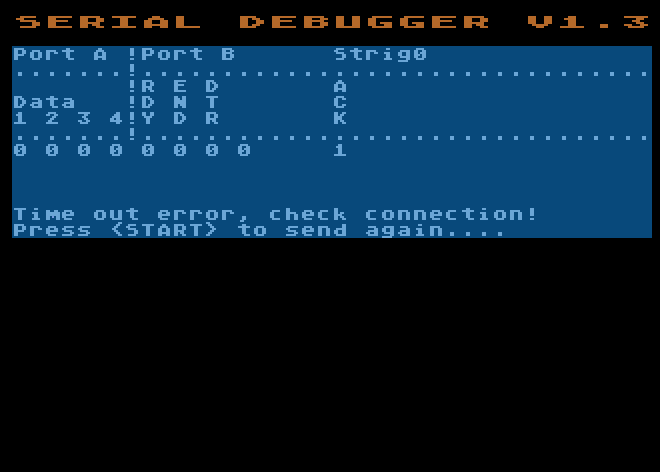
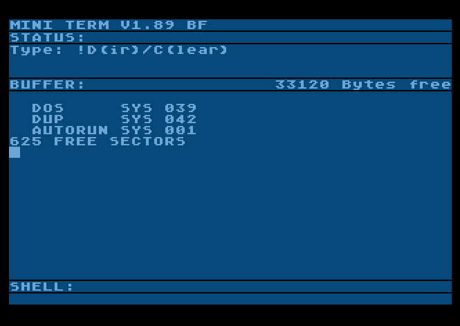

Atari Parallel Interface
------------------------
Transfer data via the Atari's joystick ports to/ from the modern world.

<i>Disk image, PicoDos format contains all the tools</i>

<i>The debugger tool, watch the bit's go by...</i>

<i>A minimalistic terminal program.</i>

Schematic's will follow soon...
